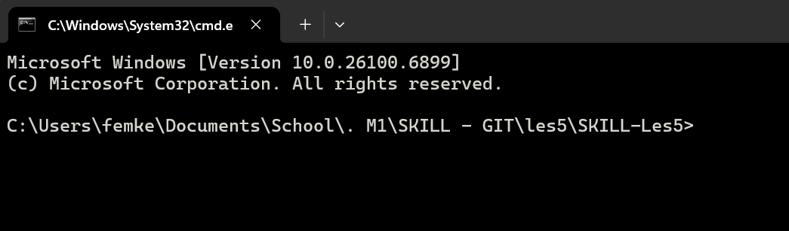

# SKILL-Les5
## Git and Github are two different softwares, made by different people. Funfact; Git is made by the man who invented Linux! To use Git all you need is the application and a command prompt. 

### Components: The differences between repositories, directories, and local vs remote? Well, a repository is an information bank in Github. Directory refers to the path something takes (Lesson > Test > Code, etc), and local is on your laptop while remote means on a server.

#### git init, git remote add origin, git add . , git commit -m “Commit message”

##### 1. git init ; initialising repository
##### 2. git remote add origin ;
##### 3. git add . ; adds files
##### 4. git commit -m “Commit message”
